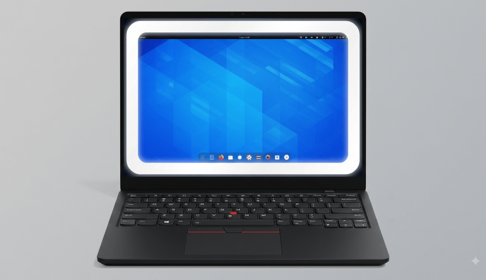

# GNOME Ring Light

GNOME Shell extension that adds a soft light around every monitor. It reserves
the light's space as a GNOME Shell chrome strut, so maximized, tiled, and newly
placed windows stay inside the light.



Useful for video calls, streaming, recording, or any setup that needs simple
monitor-edge lighting without a physical lamp.

## Features

- Multi-monitor support; ring rebuilds when monitors are added or removed
- Automatic activation when a camera is in use
  - Uses GNOME Shell's PipeWire camera monitor
  - Also detects browsers that open `/dev/video*` directly
- Quick Settings control with three modes: **Automatic**, **Always On**, and
  **Off**
- Click-through overlay; it does not intercept application input
- Maximized and tiled windows respect the reserved light area
- Fullscreen windows ignore struts by design, so the ring remains visible during
  calls and playback
- Adjustable brightness, color temperature, and corner radius
- Optional cursor transparency: fade ring around pointer while pointer rests on
  ring
- GNOME Shell 45–50 support

Demo: [demo.webm](demo.webm)

## Install

### Release package

Download the latest
[`ringlight@danielgenezini.shell-extension.zip`](https://github.com/dgenezini/gnome-ringlight/releases)
from Releases, then run:

```sh
gnome-extensions install ringlight@danielgenezini.shell-extension.zip
```

Restart GNOME Shell after installation. On X11, press `Alt+F2`, enter `r`, and
press Enter. On Wayland, log out and back in. Enable extension:

```sh
gnome-extensions enable ringlight@danielgenezini
```

### Source

Clone directly into GNOME's extension directory:

```sh
git clone https://github.com/dgenezini/gnome-ringlight \
  ~/.local/share/gnome-shell/extensions/ringlight@danielgenezini
```

Or clone elsewhere and symlink:

```sh
ln -s /path/to/gnome-ringlight \
  ~/.local/share/gnome-shell/extensions/ringlight@danielgenezini
```

Restart GNOME Shell, then enable it with `gnome-extensions enable` as above.

## Usage

Default mode is **Automatic**. Start or join a call using a camera; ring
appears. Stop camera use; ring fades out.

Open GNOME Quick Settings and select **Ring Light** to choose:

- **Automatic** — follow camera activity
- **Always On** — show ring regardless of camera activity
- **Off** — hide ring

Open extension preferences from **GNOME Settings → Extensions → Ring Light** to
configure:

- Color temperature: 2700 K warm yellow to 6500 K daylight white
- Brightness: 0–100%
- Corner radius
- Cursor transparency, cursor hole radius, and fade width

Settings can also be changed with `gsettings`:

```sh
gsettings set org.gnome.shell.extensions.ringlight ring-mode always
gsettings set org.gnome.shell.extensions.ringlight brightness 75
gsettings set org.gnome.shell.extensions.ringlight ring-color-temperature 4500
```

## Behavior and limitations

- Overlay is non-reactive, so clicks pass through to windows underneath.
- If GNOME's camera monitor cannot be created, Automatic mode keeps ring on and logs warning.
- Fullscreen applications do not honor work-area struts; ring remains visible.

## Development

Repository is intended to be symlinked into extension directory. No build step.

Check JavaScript syntax:

```sh
node --check extension.js prefs.js
```

After code changes, perform full GNOME Shell restart. Disabling and enabling
extension alone may reuse cached GJS modules.

After schema changes, recompile committed schema binary:

```sh
glib-compile-schemas schemas/
```

Watch GNOME Shell errors:

```sh
journalctl -f /usr/bin/gnome-shell
```

Manual smoke test:

1. Camera on: ring appears.
2. Camera off: ring disappears.
3. Add/remove monitor while active: ring rebuilds.
4. Disable extension while active: work area restores.

## License

[GPL-2.0-or-later](LICENSE)
